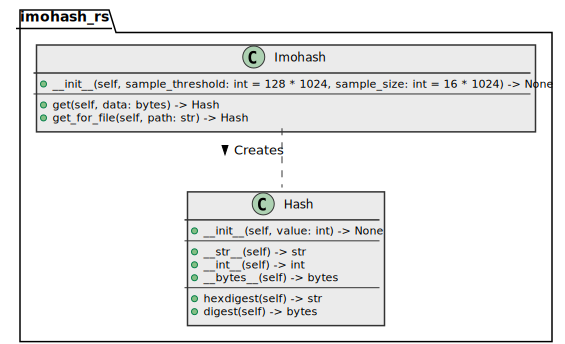
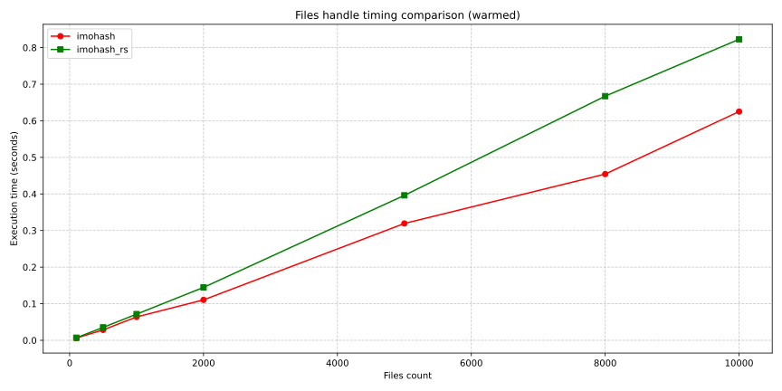
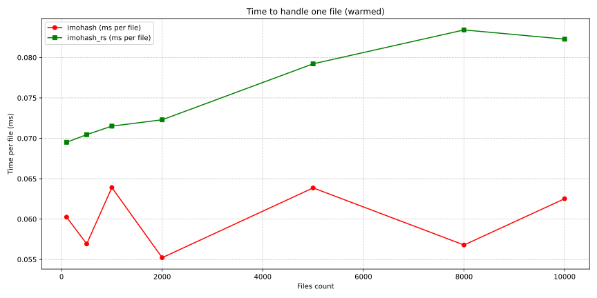
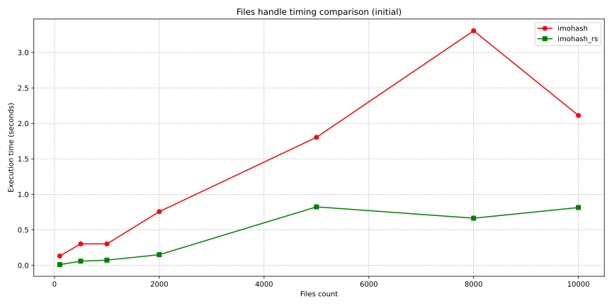
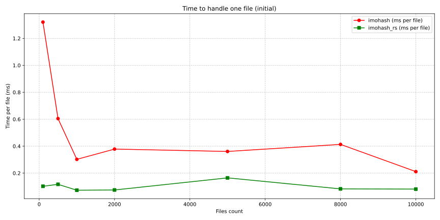

# imohash_rs

imohash_rs is a fast, constant-time hashing library for Python, and application 
to hash files from the command line. It uses file size and sampling to calculate hashes quickly, regardless of file size.

---

imohash_rs is built on top of Rust component: [hiql/imohash](https://github.com/hiql/imohash).

## Alternative implementations

- **Java**: <https://github.com/dynatrace-oss/hash4j>
- **JavaScript/TypeScript**: <https://github.com/clockwork-dog/imohash>
- **Python**: <https://github.com/kalafut/py-imohash>
- **Rust**: <https://github.com/hiql/imohash>
  - **Python**: <https://github.com/unsektor/py-imohash> (this one)

## Algorithm

Consult the [documentation](https://github.com/kalafut/imohash/blob/master/algorithm.md) for more information.

## Misuses

Because imohash only reads a small portion of a file's data, it is not suitable for:

- file verification or integrity monitoring
- cases where fixed-size files are manipulated
- anything cryptographic

The original project created by [Jim Kalafut](https://github.com/kalafut), check out <https://github.com/kalafut/imohash>

## Installation

```sh
pip install imohash_rs
```

> [!NOTE]
> Since underlying module requires compilation, 
> suitable release for some platforms may not be published
> 
> ```
> $ pip install imohash_rs
> ERROR: Could not find a version that satisfies the requirement imohash_rs (from versions: none)
> ```
> 
> In this case [manual build and installation](#development--build) is required.

## Architecture overview

[](docs/_static/architecture-overview.class-diagram.svg)

## Benchmark
### Comparison with imohash

`imohash` is a package that provides native python implementation of imohash algorithm (see <https://github.com/kalafut/py-imohash>).

See [bench.ipynb](bench.ipynb) for details:

[](docs/_static/performance_comparison.warmed.svg)
[](docs/_static/time_per_operation.warmed.svg)

<details>
   <summary>Initial launch</summary>

[](docs/_static/performance_comparison.initial.svg)
[](docs/_static/time_per_operation.initial.svg)

</details>

Graphics analyze reveals, that native implementation (`imohash`) is faster in case of sequent files processing.

## Usage

Component provides Python API (for usage in code), and CLI application.

### Python API

```python3
import imohash_rs

imohash = imohash_rs.Imohash()
# Adjust hash settings with `sample_threshold` and `sample_size` parameters:
# imohash = imohash_rs.Imohash(sample_threshold=imohash_rs.SAMPLE_THRESHOLD, sample_size=imohash_rs.SAMPLE_SIZE)

if True:  # ... calculate hash for file 
   hash_ = imohash.get_for_file(path=imohash_rs.__file__)
   # Hash(value=173061995066865536926914513679577055882)

   hash_.hexdigest()
   # '0c246e9df1ac5b0d4536efbe96244aa8'

if True:  # ... calculate hash for bytes data
   hash_ = imohash.get(data=b'example data')
   # Hash(value=223695275369458893910658172564464870412)

   hash_.hexdigest()
   # '0c246e9df1ac5b0d4536efbe96244aa8'

   hash_.digest()
   # b'\x0c$n\x9d\xf1\xac[\rE6\xef\xbe\x96$J\xa8'
```

### CLI application

Component provides a CLI sample application to hash files, similar to md5sum:

```sh
python3 -m imohash_rs  # ... options and arguments
```

Application options:

- `-t` / `--sample-threshold` — Sample threshold value.
- `-s` / `--sample-size` — Sample size value. The entire file will be hashed (i.e. no sampling), if `sample_size < 1`
- `-f` / `--format` of `{ int | bytes | hex }` — Hash representation format. Default `hex`
- `-i` / `--interactive` — Interactive hash computation mode. **Conflicts with** `[file_path ...]` argument
- `[file_path ...]` — File paths to compute hash of. **Conflicts with** `-i/--interactive` argument

**Usage example:**

1. Compute hash sum of file(s):
   ```sh
   # echo example > /tmp/my_file
   python3 -m imohash_rs /tmp/my_file
   ```
   prints:
   ```
   0877d8731ad98e5ee1cc09c0a87772bf  /tmp/my_file
   ```
2. Compute hash sum of file(s) with `find` application result:
   ```sh
   # dd if=/dev/random of=/tmp/1.iso bs=1M count=64
   # dd if=/dev/random of=/tmp/2.iso bs=1M count=64
   # cp /tmp/1.iso /tmp/3.iso
   
   find /tmp -type f -iname '*.iso' -exec python3 -m imohash_rs {} \+
   ```
   prints:
   ```
   808080203afea9085df78cd992f28546  /tmp/1.iso
   8080802011cdd41fbddd9c1f853c1330  /tmp/2.iso
   808080203afea9085df78cd992f28546  /tmp/3.iso  # as same as #1 !
   ```
3. Compute hash of string content (as bytes data) interactively:
   ```sh
   python3 -m imohash_rs -i  # ... or implicitly: python3 -m imohash_rs
   ```

   ```
   Interactive mode (format: hex)
   > example
   07ce528a343b2b99d4bd1bcdd648d138
   > example 2
   09b17440da02c7feb0b54f89d4d7b142
   >
   ```

## Development & Build

1. [Install Rust](https://www.rust-lang.org/tools/install) 
2. Build wheel package with maturin:

   ```sh
   ## initial setup
   python3 -m venv venv
   source venv/bin/activate
   python3 -m pip install -r requirements-dev.lock
   ```
   1. Development build:
      ```sh
      maturin develop
      # maturin develop --release --strip
      ```
   2. Production build:
      ```sh
      maturin build --release
      ```
      If build is success, output will look like:

      ```
      📦 Built wheel for CPython 3.9 to /private/tmp/py-imohash/target/wheels/imohash_rs-0.1.0-cp39-cp39-macosx_10_12_x86_64.whl
      ```
      Then, built wheel package may be installed manually:

      ```
      (venv) $ pip install /private/tmp/py-imohash/target/wheels/imohash_rs-0.1.0-cp39-cp39-macosx_10_12_x86_64.whl
      Processing ./target/wheels/imohash_rs-0.1.0-cp39-cp39-macosx_10_12_x86_64.whl
      Installing collected packages: imohash-rs
      Successfully installed imohash-rs-0.1.0
      ```   

## Motivation

This was primarily written for me to learn Rust.

## [Changelog](changelog.md)
## [License (MIT)](license.md)
